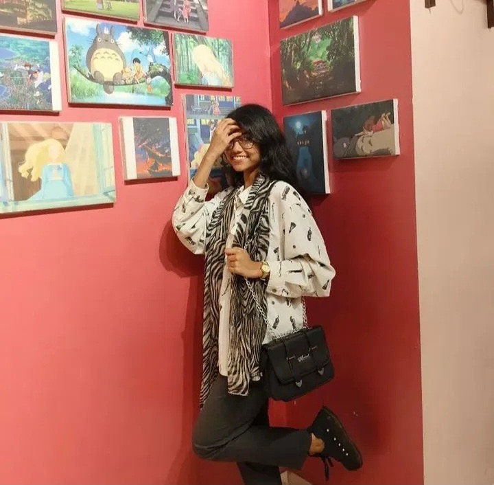
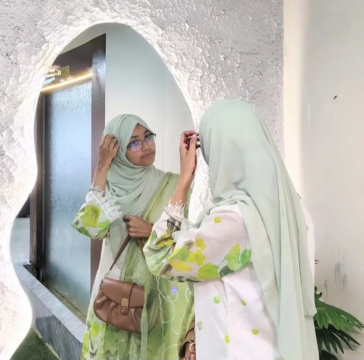
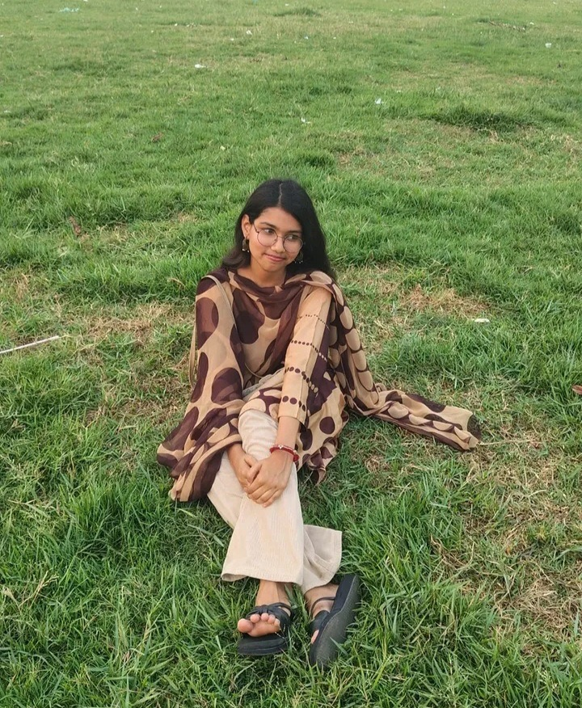
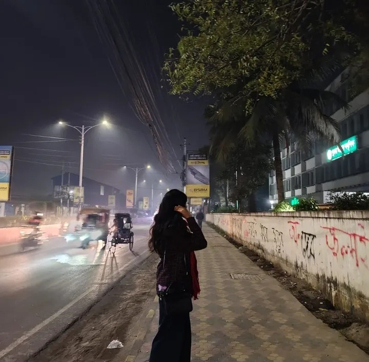

<!doctype html>
<html lang="en">
<head>
  <meta charset="utf-8">
  <title>Birthday Surprise 💖</title>
  <meta name="viewport" content="width=device-width, initial-scale=1, maximum-scale=1">

  
</head>

<body>

  <!-- =========================
       PAGE 1
  ========================= -->

  

    <h1>
      Lets explore something special 
    </h1>

    

      <button onclick="noChoice()">
        No
      </button>

      <button onclick="yesChoice()">
        Yes
      </button>

    

  

  <!-- =========================
       PAGE 2
  ========================= -->

  

    <h1>
      🎈 Surprise Loading 🎈
    </h1>

    

    <h2 id="countdown">
      3
    </h2>

  

  <!-- =========================
       PAGE 3
  ========================= -->

  

    

      ❤️ ❤️ ❤️ ❤️ ❤️ ❤️ ❤️ ❤️ ❤️ ❤️
    

    

    <h1>
      Happy Birthday
    </h1>

    <h2>
      To my Little Sister ! ❤️
    </h2>

    

      <h3>
        Your journey of
      </h3>

      

        0
      

      

        Beautiful Years
      

      

        Every single day has been a blessing.
        From your first hello to today. You bring so much joy,
        laughter and endless haphappiness . Keep being the amazing
        kind and beautiful girl that you are.
      

    

    

      ⬇️
    

  

  <!-- =========================
       PAGE 4
  ========================= -->

  

    <h1>
      Your Precious Moments
    </h1>

    

      

        

        

          Slay Queen💅
        

      

      

        

        

          Hijabi Girl🧕
        

      

      

        

        

          Angry Bird👾
        

      

      

        

        

          Makeup shundori🌝
        

      

    

    

    

    

    

      ⬇️
    

  

  <!-- =========================
       PAGE 5
  ========================= -->

  

    <h1>
      A Letter For My Little One
    </h1>

    

    

      

        Enni,
      

      

          You may be younger than me but you hold such a
          special place in my heart . Watching you grow ,smile
          and become the amazing person you are makes me 
          incredibly proud.
      

      

          No matter how much we tease ach other or 
          argue over the smallest things , I'll always be there
          for you-whenever you need me , wherever life
          takes you.
      

      

      

          I hope this new year of your life brings you
          countless reasons to smile ,beautiful memories , big
          dreams and the courage to chase every one of 
          them. Never stop being the kind, beautiful and 
          wonderful girl you are.
      

      

        Happy Birthday, Little one.❤️
        May you always be happy, loved and blessed. And
        remember - your big bro never forget your birthday👀
      

      
 

      
      

        With all my heart, 
        Me
      

    

  

  <!-- =========================
       JAVASCRIPT
  ========================= -->

  

</body>
</html>
